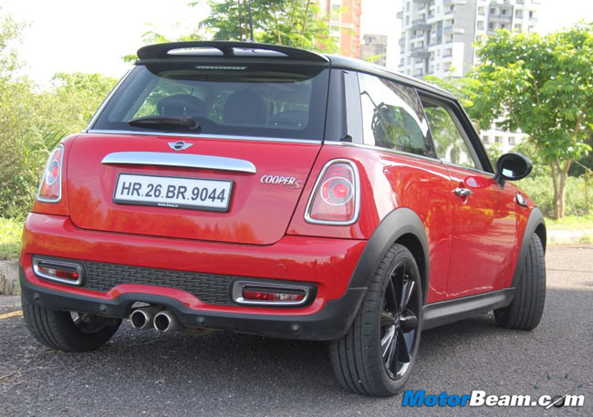

# **Automatic Number Plate Recognition**
This is an AI, which will detect the number plate of a car from a given image and extract the Number Plate data from that Image.

### Libraries Used :-
- OpenCV
- Tkinter
- Numpy
- EasyOCR
- iMultils

## **The Basics**
The *Automatic Number Plate Detection* or ANPR works by taking input of an Image (jpeg or png) and searches for a rectangular shaped number plate and finally Extracting the number from it.
An exponential increase in the number of vehicles necessitates the use of automated systems to maintain vehicle information for various purposes. But for now this Program takes images as input ie, live video input not supported.

<!--  -->

## **Implementation**
There are five steps to the detection.
- Read Image and Convert to Grayscale using OpenCV
- Apply Filters and Find edges for Localization
- Find contours and Mask it
- Using EasyOCR and convert ImageToText
- Render Result using OpenCV and Tkinter

We are opening the Image through OpenCV by using Tkinter askdialog to get the path of the Image through browsing. After reading the image we convert the Image into a Grayscale image.

With the grayscale image, we reduce the noise & Smoothen the image using BiLateral Filter, and using Canny to detect the Edges.

Finding the edges, we then use imultils to find a rectangle which is most probably the number plate. Then we crop the image into the number plate and using Easy OCR the text is extracted and we then Render the Image and show it to User.

### **Extra Features**
Added second window where Recognised text and AI Confidence level is displayed.

